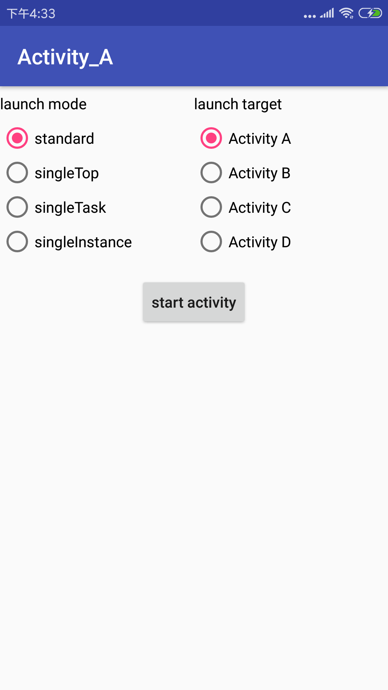

## Activity启动模式测试

> 用 adb shell dumpsys activity | grep com.capsule.exal | grep 'Run #[0-9]' 命令查看Activity栈

## standard

每次创建新的实例，没什么好说的。

## singleTop:

1.栈顶复用，复用时的行为：调用`onNewIntent()`、`onResume()`，不会调用`onCreate()`、`onStart()`、`onRestart()`。

2.若在栈顶，则不新建Activity，而

## singleTask

1.栈内复用。

2.启动时会将标志设为 FLAG_ACTIVITY_NEW_TASK，此时会检查 affinity属性，若具有该属性的栈不存在，则新建栈，否则，将Activity加入已存在的栈。（这说明，不同应用的Activity可以在同一个栈中）

## singleInstance

全局唯一，在Android系统中，只会有一个实例，并独占一个栈。

## taskAffinity

1.当 Activity的启动为FLAG_ACTIVITY_NEW_TASK时，会检查affinity属性。
